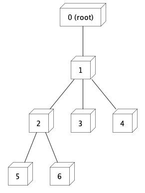
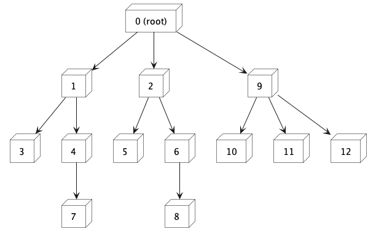

# Tree Node Problems and Solutions

This repository provides solutions to two common tree node problems: calculating the sum of node IDs and sorting nodes based on the number of children. Two approaches, recursive and hashmap, are implemented to solve these problems.

## Problem 1: Calculate the Sum of Node IDs

Given a tree represented by a collection of nodes, each having a unique ID and a list of children, the task is to calculate the sum of all node IDs in the tree.

In this instance, the sum of all node IDs is 21.

### Recursive Approach

The recursive approach involves traversing the tree in a recursive manner and adding the IDs of all nodes. Starting from the root node, we recursively visit each child node. If a node has no children, its ID is added to the sum. If a node has children, we calculate the sum of their IDs recursively and add it to the node's ID. The process continues until all nodes in the tree are visited.

### Hashmap Approach

The hashmap approach uses a hashmap data structure to store the nodes during a depth-first traversal. We start with the root node and iteratively visit each node using a stack. While visiting each node, we add its ID to the sum. If a node has children, we push them onto the stack for further processing. After traversing the entire tree, we return the sum of node IDs.

## Problem 2: Sort Nodes Based on Number of Children

Given a tree represented by a collection of nodes, each having a unique ID and a list of children, the task is to sort the nodes based on the number of children they have, in descending order.

In this instance, the sorted order of nodes is `[0 (root), 9, 2, 1, 6, 4, 12, 11, 10, 8, 5, 7, 3]`

### Recursive Approach

The recursive approach can be extended to solve this problem as well. After calculating the sum of node IDs recursively, we can sort the nodes based on the number of children. We can achieve this by modifying the recursive function to return an array of nodes instead of the sum. Each node object will include its ID, the number of children, and the child nodes. Finally, we sort the array of nodes based on the number of children in descending order.

### Hashmap Approach

The hashmap approach can also be used to solve this problem. While traversing the tree using the hashmap approach, we store each node in a hashmap along with its number of children. After traversing the entire tree, we convert the hashmap to an array and sort the nodes based on the number of children in descending order.
