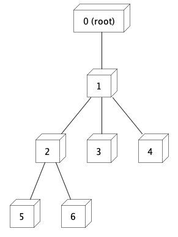

# Sum of Node IDs in a Tree

This repository provides a solution to the problem of calculating the sum of all node IDs in a tree structure using two different approaches: recursive and hashmap optimization.

## Problem

Given a tree data structure represented by `TreeNode` objects, the task is to calculate the sum of all node IDs in the tree.

## Tree Structure

The `TreeNode` type is defined as an object with three properties: `id` of type number, `name` of type string, and `children` which is an array of `TreeNode` objects representing the children of the current node.

## Recursive Approach

The recursive approach is implemented in the `recursive` function. It takes a `TreeNode` object as a parameter and recursively calculates the sum of all node IDs in the tree. If a node has no children, it returns the ID of the node. Otherwise, it calculates the sum of the current node's ID and the recursive calls to `recursive` for each child node. The `map` function is used to apply the `recursive` function to each child node, and then the `reduce` function is used to sum up the results.

## Hashmap Approach for Optimszation

In some cases, the recursive approach might result in redundant calculations. To optimise the solution, a hashmap can be used to store the sum of node IDs for each subtree. This avoids recalculating the sum for the same subtree multiple times.

The hashmap optimisation approach involves traversing the tree in a bottom-up manner. Starting from the leaf nodes, we calculate and store the sum of node IDs for each subtree in the hashmap. Then, when we encounter a parent node, we can easily access the sums of its child subtrees from the hashmap and calculate the sum for the parent node. This way, we avoid redundant recursive calculations.

## Usage

To calculate the sum of node IDs in a tree, follow these steps:

1. Define the tree structure using `TreeNode` objects.
2. Call the `recursive` function, passing the root node of the tree as the parameter.
3. The function will return the sum of all node IDs in the tree.

## Example

Consider the following example tree structure:

For this tree, the sum of node IDs is 21.
